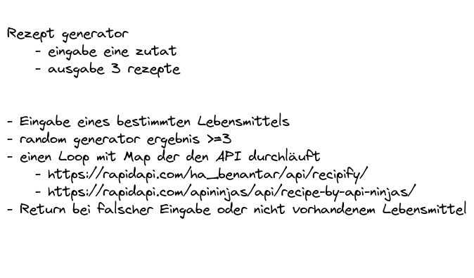

# DCIAppProjectGroup4

Build an Node-App in a working Group

**[Test this app yourself](github.link)**

---

#### Navigation

- About Project
  - _Description_
  - _Developed With_
- How to use this Project
  - _Description_
  - _Developed With_
- Contact
  - _Mail_
  - _GitHub_
  - _LinkedIn_
- Used Tools
  - _Fonts_
  - _Design_
  - _Icons_
  - _Colors_

---

### About Project

Wir entwickeln eine App die dir dabei hilft ein zufälliges Rezept zu finden, anhand einer beliebigen Zutat

### How to use this Project

Schau in deinem Kühlschrank und nimm eine Zutat, gib diese in der App ein und wir bieten dir 3 super nice Rezeptideen an :)

##### Developed With

- [ ] _HTML5_
- [ ] _CSS3_
- [ ] _SASS_
- [ ] _SCSS_
- [x] _JavaScript_
- [ ] _React_
- [ ] _Bootstrap_
- [x] _npm_
- [x] _RapidAPI_
- [x] _Excalidraw_

---

### Contact 

|  |  |  |
| :----------------------------------------------------------------------------: | :---------------------------------------------------------------------------: | :----------------------------------------------------------------------: |
|       <a href= "https://github.com/holledrums">Holledrums on GitHub</a>        |         <a href= "https://github.com/sihamsaidi">Siham on GitHub</a>          |  <a href= "https://github.com/dennispiecha">DennisPiecha on GitHub</a>   |

---

### Used Tools

- [npm](https://www.npmjs.com/)
- [Visual Studio Code](https://code.visualstudio.com/)
- [RapidAPI](https://rapidapi.com/apininjas/api/recipe-by-api-ninjas/)

---

Made with ❤️ by us

Dennis | Holger | Siham
