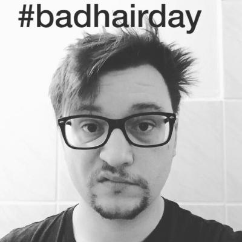

# DCIAppProjectGroup4

Build an Node-App in a working Group

**[Test this app yourself](github.link)**

---

#### Navigation

- About Project
  - _Description_
  - _Developed With_
- How to use this Project
  - _Description_
  - _Developed With_
- Contact
  - _Mail_
  - _GitHub_
  - _LinkedIn_
- Used Tools
  - _Fonts_
  - _Design_
  - _Icons_
  - _Colors_

---

### About Project

Wir sind eine gutes Team
&&
Wir entwickeln gemeinsam eine App in Node

### How to use this Project

lorem

##### Developed With

- [x] _HTML5_
- [x] _CSS3_
- [ ] _SASS_
- [ ] _SCSS_
- [x] _JavaScript_
- [ ] _React_
- [ ] _Bootstrap_
- [x] _npm_
- [ ] _..._

---

### Contact

 
 <a href= "https://github.com/holledrums">Holledrums on GitHub</a> 

 <a href= "https://github.com/sihamsaidi">Siham on GitHub</a> 

 <a href= "https://github.com/dennispiecha">DennisPiecha on GitHub</a> 

---

### Used Tools

- [icons](https://)
- [Canva](https://www.canva.com/)
- [npm](https://www.npmjs.com/)
- [Google Fonts](https://fonts.google.com/)
- [Visual Studio Code](https://code.visualstudio.com/)
- [ColorZilla](https://www.colorzilla.com/chrome/)

---

Made with ❤️ by us

Dennis | Holger | Siham
